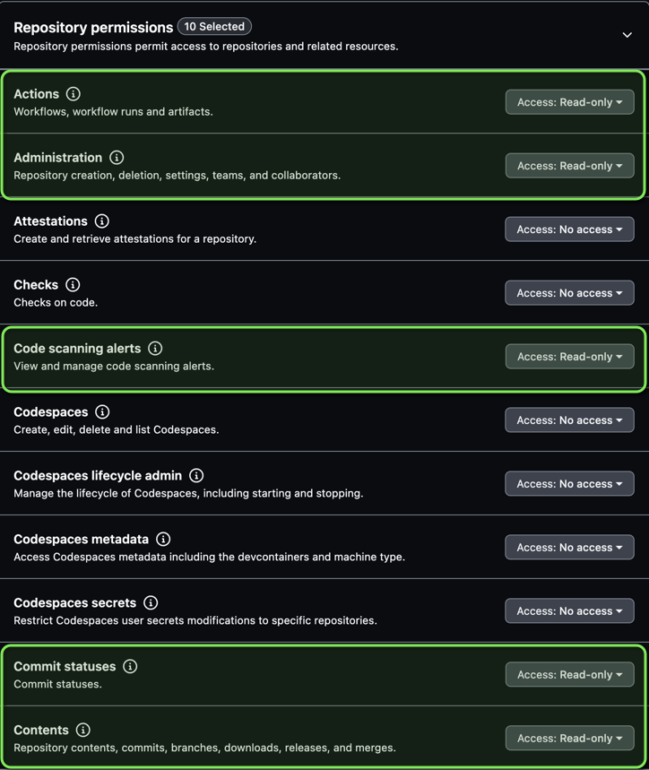
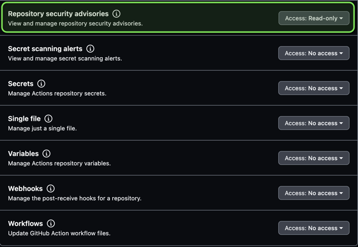

# GitHub App Authentication

<!-- markdownlint-disable -->
<!-- status autogenerated section -->
| Status        |           |
| ------------- |-----------|
| Stability     | [alpha]  |
| Distributions | [] |
| Issues        | [](https://github.com/open-telemetry/opentelemetry-collector-contrib/issues?q=is%3Aopen+is%3Aissue+label%3Aextension%2Fgithubappauth) [](https://github.com/open-telemetry/opentelemetry-collector-contrib/issues?q=is%3Aclosed+is%3Aissue+label%3Aextension%2Fgithubappauth) |
| Code coverage | [](https://app.codecov.io/gh/open-telemetry/opentelemetry-collector-contrib/tree/main/?components%5B0%5D=extension_githubappauth&displayType=list) |

[alpha]: https://github.com/open-telemetry/opentelemetry-collector/blob/main/docs/component-stability.md#alpha
<!-- end autogenerated section -->
<!-- markdownlint-enable -->

This authentication extension supports authenticating to GitHub by
authenticating to [GitHub as an installation][gh-inst]. This was purpose built
for the GitProviderReceiver to reduce the need for PATs and [reduce rate
limiting][rate].

There are a few pre-reqs you have to do in order to get a GitHub App to work
with this extension. These instructions may change based on changes to GitHub.

[gh-inst]: https://docs.github.com/en/apps/creating-github-apps/authenticating-with-a-github-app/authenticating-as-a-github-app-installation
[rate]: https://docs.github.com/en/graphql/overview/rate-limits-and-node-limits-for-the-graphql-api#primary-rate-limit

## Creating a GitHub Application

Below you'll find the instructions to create a GitHub App. This information
will often link to GitHub official documentation. Any images or instructions
below that go into more detail than the official document do so because they're
tailored with the settings recommended for the companion [GitProvider
Receiver][gpr].

[gpr]: https://github.com/liatrio/liatrio-otel-collector/tree/main/receiver/gitproviderreceiver

1. [Register a new GitHub Applicaton][reg] following steps 1 - 8. **Do NOT** do
   steps 9 - 18.
2. In step 19, setup the repository permissinos needed correctly. These
   permissions should be **Read-only** based on the default set of metrics
   supported by the [GitProvider Receiver][gpr]. Below is an example screenshot
   of what permissions needed by the [GitProvider Receiver][gpr].





3. Install the App in step 21 to your desired location. If using the
   [GitProvider Receiver][gpr] it is easiest to install organization or user
   account wide. If you choose to install only on select repositories, ensure
   that your query in the GitHub Scraper section will only return the
   repositories you have installed within your app.
4. Click create as in step 22. 
5. Navigate to your newly created GitHub App on the **General** tab and
   retrieve the `App ID`. This will be used by your extension configuration.
6. While on this tab, scroll to the bottom of the app and generate a private
   key. Store it in a secrets manager safely.
7. Navigate to the **Install App** tab in your GitHub app and then select the
   gear icon. In the URL search bar you should now be able to retrieve your
   installation ID which will be used in the `installation_id` field within the
   extension configuration. The format of the URL should be
   `https://github.com/organizations/<your
   org>/settings/installations/<installation id>`
8. Update your GitHub App Extension configuration to reflect those values like
   below.

```yaml
extensions:
  githubappauth:
    app_id: 1234
    installation_id: 1234
    private_key_file: "path/to/key.pem"

receivers:
  gitprovider:
    initial_delay: 1s
    collection_interval: 60s
    scrapers:
      scraper:
        metrics:
          git.repository.contributor.count:
            enabled: true
          git.repository.cve.count:
            enabled: true
        github_org: myfancyorg
        #optional query override, defaults to "{org,user}:<github_org>"
        search_query: "org:myfancyorg topic:o11yalltheway"
        endpoint: "https://selfmanagedenterpriseserver.com"
        auth:
          authenticator: githubappauth
service:
  extensions: [githubappauth]
  pipelines:
    metrics:
      receivers: [..., gitprovider]
      processors: []
      exporters: [...]
```

Note: Private keys are sensitive by nature and will be used to sign the JWT
passed to GitHub. It's important to protect these values through proper Secrets
Management controls.

[reg]: https://docs.github.com/en/apps/creating-github-apps/registering-a-github-app/registering-a-github-app#registering-a-github-app
